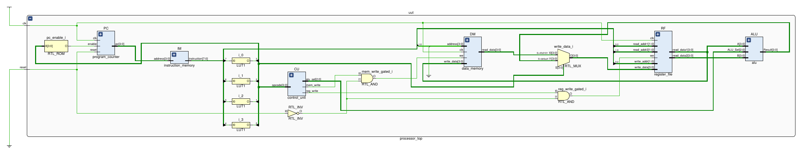
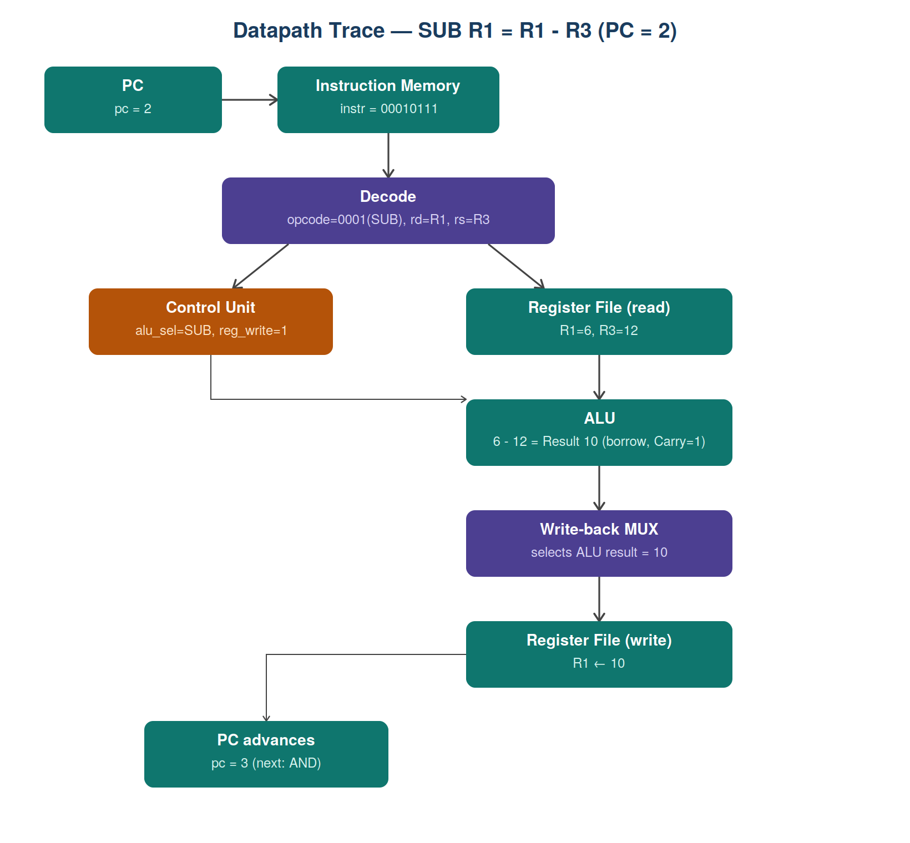
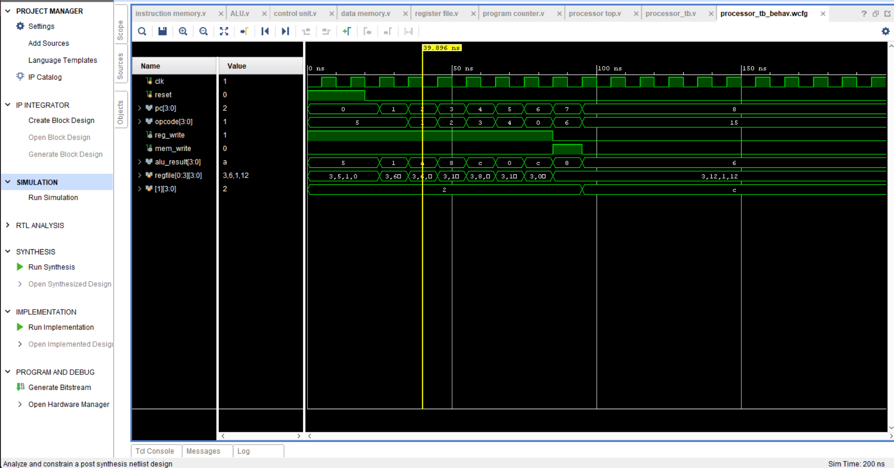
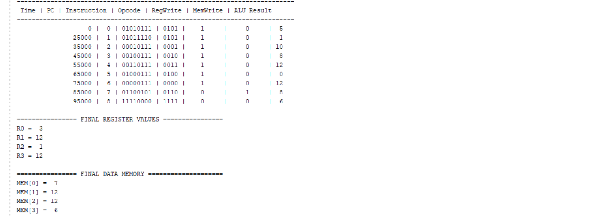

# 🚀 4-Bit Single-Cycle Processor using Verilog HDL


## 📖 Overview

A custom **4-bit single-cycle processor** built in Verilog HDL, integrating a Program Counter, Instruction Memory, Control Unit, Register File, ALU, and Data Memory into a complete, working CPU. The processor fetches an instruction, decodes it, executes it, and writes back the result — all within a single clock cycle — and halts cleanly via a dedicated HALT instruction.

## 🎯 Objectives

- Design a working single-cycle processor datapath from scratch in Verilog.
- Implement a minimal but complete instruction set (arithmetic, logic, memory, control).
- Verify every module individually, then verify the full pipeline end-to-end in simulation.
- Document the design decisions behind the instruction format and memory addressing scheme.

## ✨ Features

- Modular Verilog design — each block has one responsibility
- Program Counter with reset and HALT-aware freeze
- 4-register file with dual asynchronous read ports, synchronous write
- ALU supporting ADD, SUB, AND, OR, XOR, NOT, INC, PASS
- LOAD / STORE data memory access
- HALT instruction that correctly freezes the processor
- Zero and Carry flags
- Verified in both Icarus Verilog and Vivado's simulator, on real hardware tooling

## 🏗 Architecture

The design is split into six modules, each with a single responsibility:

| Module | Responsibility |
|---|---|
| `program_counter` | Tracks the address of the next instruction; freezes on HALT |
| `instruction_memory` | 16×8 ROM holding the program |
| `control_unit` | Decodes the opcode into control signals for the rest of the datapath |
| `register_file` | 4×4-bit registers; two async read ports, one sync write port |
| `alu` | Performs the actual arithmetic/logic operation |
| `data_memory` | 16×4-bit RAM for LOAD/STORE |

`processor_top` wires all six together, plus a write-back multiplexer that selects between the ALU's result and a memory read, depending on the opcode.

**Synthesized RTL schematic (Vivado):**



This is Vivado's elaborated view of the actual synthesized hardware — notice the two `RTL_AND` gates (`mem_write_gated_i`, `reg_write_gated_i`) sitting between the control unit and the register file/data memory. These are the physical realization of the reset-gating fix described later in this document — visual confirmation the fix is present in the real synthesized design, not just in source code.

## 📝 Instruction Format

```
 7      4 3    2 1    0
+---------+------+------+
| Opcode  |  RD  |  RS  |
+---------+------+------+
```

This is a **2-operand, destructive format**: `ADD Rd, Rd, Rs` means `Rd = Rd + Rs`, overwriting `Rd`. With only 8 instruction bits and 4 reserved for opcode, there isn't room for a separate 3rd operand field — a common tradeoff in minimal instruction sets.

For `LOAD`/`STORE`, the `RS` field is reinterpreted as a **2-bit immediate memory address** (0–3) rather than a register selector — so only 4 of the 16 data memory locations are reachable by the current instruction set.

## 💻 Instruction Set

| Opcode | Instruction | Description |
|---|---|---|
| `0000` | ADD | `R[RD] ← R[RD] + R[RS]` |
| `0001` | SUB | `R[RD] ← R[RD] − R[RS]` |
| `0010` | AND | `R[RD] ← R[RD] & R[RS]` |
| `0011` | OR | `R[RD] ← R[RD] \| R[RS]` |
| `0100` | XOR | `R[RD] ← R[RD] ^ R[RS]` |
| `0101` | LOAD | `R[RD] ← Memory[RS]` |
| `0110` | STORE | `Memory[RS] ← R[RD]` |
| `1111` | HALT | Stops processor execution |

> **Note:** the ALU hardware supports 8 operations total (`ADD, SUB, AND, OR, XOR, NOT, INC, PASS`), but the current instruction set only exposes 5 of them (`ADD, SUB, AND, OR, XOR`) via opcodes. `NOT`, `INC`, and `PASS` exist in `alu.v` and are reserved for future instructions — see Future Enhancements.

## 📜 Example Program

Before execution, `register_file` starts with `R0=3, R1=5, R2=1, R3=0`, and `data_memory` holds `MEM[0]=7, MEM[1]=2, MEM[2]=12, MEM[3]=6`.

| PC | Instruction | Opcode | Operation | Result |
|---|---|---|---|---|
| 0 | `01010111` | LOAD | R1 ← MEM[3] | R1 = 6 |
| 1 | `01011110` | LOAD | R3 ← MEM[2] | R3 = 12 |
| 2 | `00010111` | SUB | R1 = R1 − R3 | R1 = 10 (borrow, Carry=1) |
| 3 | `00100111` | AND | R1 = R1 & R3 | R1 = 8 |
| 4 | `00110111` | OR | R1 = R1 \| R3 | R1 = 12 |
| 5 | `01000111` | XOR | R1 = R1 ^ R3 | R1 = 0 |
| 6 | `00000111` | ADD | R1 = R1 + R3 | R1 = 12 |
| 7 | `01100101` | STORE | MEM[1] ← R1 | MEM[1] = 12 |
| 8 | `11110000` | HALT | — | pc frozen at 8 |

## 🔍 Working of the Processor — One Instruction Traced in Full

To make the datapath concrete rather than abstract, here's every block's role, walked through for the **SUB instruction at PC=2** (`R1 = R1 - R3`, at the point where `R1=6` and `R3=12` from the two prior LOADs):

1. **Program Counter** holds `pc = 2`, sent to instruction memory as an address.
2. **Instruction Memory** returns `00010111` for that address.
3. **Decode** (simple wire-slicing) splits this into `opcode=0001` (SUB), `rd=01` (R1), `rs=11` (R3).
4. **Control Unit** sees `opcode=0001` and outputs `alu_sel=SUB`, `reg_write=1`, `mem_write=0`.
5. **Register File (read)** returns `read_data1 = R1 = 6` and `read_data2 = R3 = 12`, asynchronously — no clock edge needed.
6. **ALU** computes `6 - 12`. Since `R1 < R3`, this wraps (via the 5-bit width-extension trick) to `Result = 10` with `Carry = 1` — signaling a borrow occurred, per this ALU's documented convention.
7. **Data Memory** is untouched this cycle (`mem_write=0`).
8. **Write-back MUX** selects the ALU's result (`opcode ≠ LOAD`), so `write_data = 10`.
9. **Register File (write)** commits on the next clock edge: `R1 ← 10`.
10. **Program Counter** advances to `pc = 3`, since `opcode ≠ HALT`.



The exact same 10-step sequence applies to every instruction in the program — only the control unit's outputs and the ALU's operation change. LOAD/STORE differ only at step 8 (the mux picks `mem_data` instead) and step 7 (data memory actually activates). HALT skips straight to step 10 with `pc_enable=0`, freezing everything in place.

## 📈 Results & Evidence

✔ Successful functional simulation (Icarus Verilog and Vivado, cross-verified)
✔ Correct control signal behavior for every opcode
✔ Correct ALU results, including carry/borrow edge cases
✔ Correct register file read/write timing
✔ Correct write-back multiplexing (ALU result vs. memory read)
✔ Full program executes correctly end-to-end; HALT freezes PC as expected

**Simulation waveform (Vivado, full 200 ns run):**



**Console output (final state, unambiguous cross-check):**



Final state, confirmed identical across both simulators:

| Register | Value | | Memory | Value |
|---|---|---|---|---|
| R0 | 3 | | MEM[0] | 7 |
| R1 | 12 | | MEM[1] | 12 (changed by STORE) |
| R2 | 1 | | MEM[2] | 12 |
| R3 | 12 | | MEM[3] | 6 |

## ⚠️ A design bug found and fixed during development

During integration testing, register/memory writes were found to not be gated by `reset`. Since `instruction_memory`, `control_unit`, and the `alu` are purely combinational and driven off whatever `pc` currently holds, the instruction sitting at address 0 could fire on every clock edge for as long as `reset` was held — silently corrupting state if that instruction happened to be an accumulating operation (e.g. `ADD`), even though it appeared harmless with an idempotent one (e.g. `LOAD`).

**Fix:** both `reg_write` and `mem_write` are now ANDed with `~reset` (`reg_write_gated`, `mem_write_gated`) before reaching `register_file` and `data_memory`, guaranteeing no write can occur while reset is asserted. Verified via a controlled before/after simulation comparison — see `processor_top.v` for the inline comments explaining why this matters.

## ▶️ How to Run

### Simulation (Vivado)
1. Open Vivado and create a new RTL project.
2. Add all `.v` design files (`alu.v`, `register_file.v`, `control_unit.v`, `program_counter.v`, `instruction_memory.v`, `data_memory.v`, `processor_top.v`).
3. Set `processor_top.v` as the top module.
4. Add `processor_tb.v` as the simulation source and set it as the simulation top.
5. Run Behavioral Simulation.
6. In the waveform viewer, add `pc`, `opcode`, `reg_write`, `mem_write`, `alu_result` from the `uut` scope, plus `regfile[0:3]` from `uut.RF` and `memory[1]` from `uut.DM`. Set their radix to Unsigned Decimal for readability, then Zoom to Fit.

### Simulation (Icarus Verilog — open source alternative)
```bash
iverilog -o sim src/alu.v src/register_file.v src/control_unit.v src/program_counter.v src/instruction_memory.v src/data_memory.v src/processor_top.v testbench/processor_tb.v
vvp sim
```
This prints the same cycle-by-cycle trace and final register/memory dump shown in `docs/console_output.png`, without needing Vivado installed.

## 📊 Design Specifications

| Feature | Value |
|---|---|
| Architecture | Single Cycle |
| Instruction Width | 8-bit |
| Data Width | 4-bit |
| Address Width | 4-bit |
| Registers | 4 |
| Instruction Memory | 16 × 8 |
| Data Memory | 16 × 4 |
| Clock | Synchronous |

## 🚀 Future Enhancements

- Multiply / Divide
- Shift and rotate instructions
- Jump / branch instructions (JMP, BEQ, BNE)
- Flags register for compare operations
- Button debouncing and FPGA hardware deployment
- Self-checking testbench with automatic pass/fail assertions
- Wider (8-bit/16-bit) processor version

## 📚 Learning Outcomes

This project provided practical experience in:
- Processor datapath and control unit design
- Instruction set architecture (ISA) design under tight bit-width constraints
- Register file and memory timing (synchronous write, asynchronous read)
- Debugging a real integration bug (reset-gating) through systematic simulation
- Verilog HDL and functional verification, cross-checked across two independent simulators

## 👨‍💻 Author
[Your name here]
